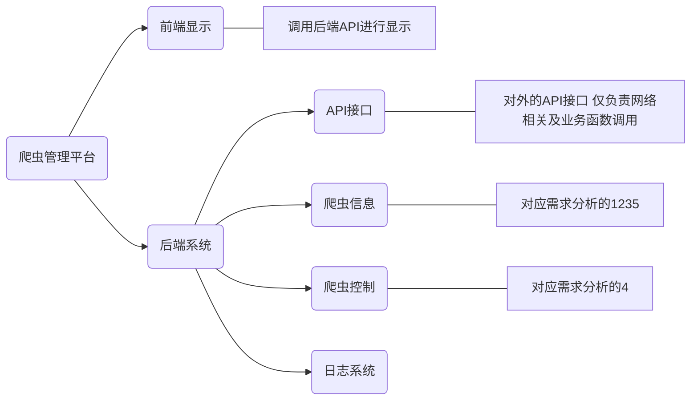
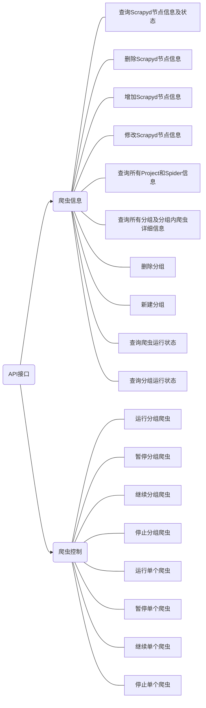

# 爬虫管理平台

## 需求分析

基于对分布式爬虫的管理需要，按顺序整理以下的需求分析。

1. 查看Scrapyd节点状态；
2. 查看Scrapyd节点下存在的Project和Spider;
3. 支持对Spider的分组功能；
4. 对Spider组和单个Spider进行控制（运行、暂停、继续、停止）；
5. 实时显示分组及Spiders的工作状态。

## 概要设计

##### 技术选型

* 后端框架：Django
* 数据库：Sqlite3
* 前端框架：React.js
* 爬虫部署平台：Scrapyd

##### 系统结构

##### 调用关系及接口

因为API模块即是内部接口与外部用户的桥梁，所以API调用的内部接口与API提供的外部接口一一对应。所以API模块调用的内部接口列表即外部接口列表。

以下是系统的内部接口图。

##### 数据库设计图

## 详细设计

#### 爬虫信息模块

##### 数据表设计（每个表省略id字段）

###### Scrapyd表

| 字段名     | 数据类型         | 选项     | 备注   |
| ------- | ------------ | ------ | ---- |
| name    | varchar(45)  | UQ, NN |      |
| ip      | varchar(45)  | NN     | IP地址 |
| port    | varchar(45)  | NN     | 端口号  |
| comment | varchar(128) |        | 简介   |

###### Project表

| 字段名     | 数据类型         | 选项     | 备注   |
| ------- | ------------ | ------ | ---- |
| name    | varchar(45)  | UQ, NN |      |
| scrapyd | int          | FK     | 外键   |
| comment | varchar(128) |        | 简介   |

###### Spider表

| 字段名     | 数据类型         | 选项     | 备注   |
| ------- | ------------ | ------ | ---- |
| name    | varchar(45)  | QU, NN |      |
| project | int          | FK     | 外键   |
| comment | varchar(128) |        | 简介   |

#### API接口模块

##### 参看内置[接口文档](http://127.0.0.1:8008/rest-api/)
